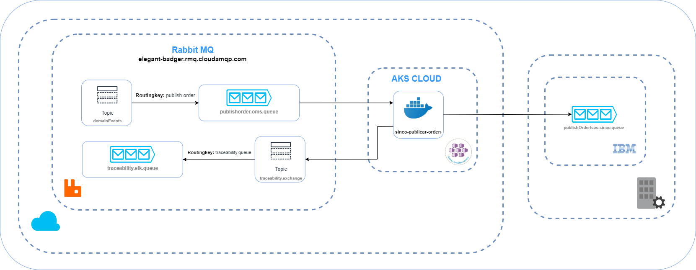
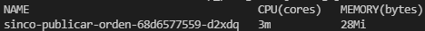

**PUBLISH ORDER OMS (sinco-publicar-orden)**

**DUEÑO FUNCIONAL DE LA SOLUCIÓN**

| **Área**     | OMS             |
|--------------|-----------------|
| **Contacto** | Margarita Ochoa |
|              | Daniel Pinilla  |


### **Tabla de contenido**

- [Descripción de la necesidad](#descripción-de-la-necesidad)
- [Diagrama de la necesidad](#diagrama-de-la-necesidad)
- [Clasificación de las interfaces](#clasificación-de-las-interfaces)
- [Atributos de calidad de la solución](#atributos-de-calidad-de-la-solución)
- [Diagrama de componentes de la interfaz](#diagrama-de-componentes-de-la-interfaz)
- [Consideraciones](#consideraciones)
- [Mapeo de datos](#mapeo-de-datos)
- [Características técnicas de la interfaz](#características-técnicas-de-la-interfaz)
- [Manejo de errores](#manejo-de-errores)
- [Manejo de reproceso](#manejo-de-reproceso)
- [Mensajes de la interfaz](#mensajes-de-la-interfaz)
- [Mensaje ELK](#mensaje-elk)
- [Manual de despliegue](#manual-de-despliegue)

* [Inventario de artefactos](#inventario-de-artefactos)
* [Directorios](#directorios)
* [Monitoreo](#monitoreo)
* [Recomendaciones](#recomendaciones)


### **Descripción de la necesidad**

Se requiere que el Middleware reciba los estados de las órdenes en ISOC para tener trazabilidad en las reservas de inventario de SINCO.

| **Nombre de la interfaz:** | **PUBLISH ORDER OMS (sinco-publicar-orden)**                                    |
|----------------------------|---------------------------------------------------------------------------------|
| **Qué**                    | Enviar los estados de las órdenes en ISOC al sistema SINCO                      |
| **Porqué**                 | Porque se requiere tener los estados de las órdenes de ISOC en el sistema SINCO |
| **Para que**               | Para tener trazabilidad en las reservas de inventario de SINCO                  |


### **Diagrama de la necesidad**


### **Clasificación de las interfaces**


### **Atributos de calidad de la solución**

En la siguiente tabla se relacionan los atributos de calidad asociados a la solución:

| **Seguridad**                                                           |                                               |
|-------------------------------------------------------------------------|-----------------------------------------------|
| **Característica**                                                      | **Observación**                               |
| Identificación y Autenticación                                          | Si                                            |
| Autorización                                                            | Si                                            |
| Confidencialidad                                                        | Si                                            |
| Integridad                                                              | Si                                            |
| Auditabilidad                                                           | Si                                            |
| **Desempeño**                                                           |                                               |
| **Característica**                                                      | **Observación**                               |
| Transacciones por Día                                                   | 5980                                          |
| Transacciones por Día de Evento                                         | 16120                                         |
| Tiempo de Respuesta Máximo en Segundos                                  | N/A                                           |
| Tiempo de Respuesta Promedio en Segundos                                | N/A                                           |
| Frecuencia                                                              | 1                                             |
| Registros entregados en orden                                           | Si                                            |
| **Escalamiento**                                                        |                                               |
| **Característica**                                                      | **Observación**                               |
| Cantidad Estimada de Transacciones por Día/Mes/Año                      | 2395640 año                                   |
| Porcentaje de Crecimiento Estimado de Transacciones por Día/Mes/Año (%) | Pendiente                                     |
| **Disponibilidad**                                                      |                                               |
| **Característica**                                                      | **Observación**                               |
| Horario de Disponibilidad de la Solución                                | 24/7                                          |
| Contingencia                                                            | Re-envío de información desde el origen       |
| **Manejo de errores**                                                   |                                               |
| **Característica**                                                      | **Observación**                               |
| Trazabilidad                                                            | Logs, ELK                                     |
| Endpoint o Partition Key                                                | sinco-publicar-orden                          |
| Errores                                                                 | Logs, ELK                                     |
| Alertamiento                                                            | Logs, ELK                                     |
| Monitoreo                                                               | Validar que se ejecute cada día               |
| Reintentos                                                              | Si, devuelve el mensaje a la cola de RabbitMQ |


### **Diagrama de componentes de la interfaz**

En el siguiente diagrama de componentes se muestra el diseño de la integración y la relación con los diferentes componentes:

> Diagrama Arquitectura Publish Order OMS:




| **Nombre Componente**        | **Descripción del componente**  | **Responsabilidad**                                                                                                                                                                                       | **Tipo**        | **Herramienta**          |
|------------------------------|---------------------------------|-----------------------------------------------------------------------------------------------------------------------------------------------------------------------------------------------------------|-----------------|--------------------------|
| publishorder.oms.queue       | Cola Origen RabbitMQ            | Cola de RabbitMQ que contiene el mensaje origen de los estados de las ordenes del Publish Order                                                                                                           | Gestor de Colas | RabbitMQ                 |
| sinco-publicar-orden         | Microservicio                   | Pod que consume los mensajes (Formato JSON) de la cola Origen de RabbitMQ y lo transforma en la estructura requerida (Formato String) para la Cola Destino de IBM Websphere MQ monitoreadas por **SINCO** | Pod Kubernetes  | Azure Kubernetes Service |
| traceability.exchange        | Tópico de Trazabilidad RabbitMQ | Tópico de RabbitMQ encargado de distribuir los mensajes a las colas asociadas de trazabilidad para ser enviado a ELK                                                                                      | Gestor de Colas | RabbitMQ                 |
| publishOrderIsoc.sinco.queue | Cola Destino IBM Websphere MQ   | Cola destino IBM Websphere MQ donde serán enviados los los estados de las ordenes del Publish Order                                                                                                       | Gestor de Colas | IBM Websphere MQ         |


### **Consideraciones**

-	Se dejara una solo instancia para QA y otra para PDN (no una instancia por estado, como se había planeado inicialmente), ya que de acuerdo a lo definido, se dejara una cola genérica, donde llegaran todos los estados de las ordenes (2000, 3000, 7000, 9000, 11000, 18000, 19000, 3600100, 3000080...).


### **Mapeo de datos**

En las siguientes tablas se relacionan el mapeo de datos que se presentan en la integración desde que se toma el mensaje en la cola de RabbitMQ y se envía a SINCO por medio de la cola de IBM Websphere MQ:

| **Nombre**     | **Descripción**                                      |
|----------------|------------------------------------------------------|
| **Componente** | sinco-publicar-orden                                 |
| **Origen:**    | Cola RabbitMQ (publishorder.oms.queue)               |
| **Destino:**   | Cola IBM Websphere MQ (publishOrderIsoc.sinco.queue) |

**NOTAS:**

* Los campos numéricos se alinean a la derecha y se rellenan de ceros a la izquierda para llegar a la longitud máxima y los campos alfanuméricos se alinean a la izquierda y se rellenan de espacios a la derecha para llegar a la longitud máxima.
* Solo se deben de enviar las ordenes con el estado 2000 (ALLOCATED), 3000 (RELEASED), 7000 (FULFILLED), 9000 (CANCELLED), 11000 (PENDIENTE DEVOLUCIÓN), 18000 (DEVUELTO), 19000 (DEVOLUCIÓN CANCELADA), 3600100 (INVOICE), 3000080 (CEDIINVOICED), 3000100 (INTRANSITTOSTORE)

| **Campo Origen**                                                                                                                              | **Transformación**                                                                                                                                       | **Campo Destino**                        | **Posición** | **Longitud** | **Tipo** | **Comentario**                                                                                                                                                                                                                                                                                                                                                                                                                                                                                                                                                                                                                                                                                              |
|-----------------------------------------------------------------------------------------------------------------------------------------------|----------------------------------------------------------------------------------------------------------------------------------------------------------|------------------------------------------|--------------|--------------|----------|-------------------------------------------------------------------------------------------------------------------------------------------------------------------------------------------------------------------------------------------------------------------------------------------------------------------------------------------------------------------------------------------------------------------------------------------------------------------------------------------------------------------------------------------------------------------------------------------------------------------------------------------------------------------------------------------------------------|
| orderLineList.orderId                                                                                                                         | N/A                                                                                                                                                      | OrderId                                  | 1            | 50           | String   | Id de la Orden                                                                                                                                                                                                                                                                                                                                                                                                                                                                                                                                                                                                                                                                                              |
| publishOrderDto.orderTypeId                                                                                                                   | N/A                                                                                                                                                      | OrderTypeId                              | 2            | 50           | String   | Id del tipo de la Orden                                                                                                                                                                                                                                                                                                                                                                                                                                                                                                                                                                                                                                                                                     |
| orderLineList.updatedTimestamp                                                                                                                | Formato YYYYmmddHHMMSSfff                                                                                                                                | UpdatedTimestamp                         | 3            | 17           | Date     | Actualización de la fecha del evento                                                                                                                                                                                                                                                                                                                                                                                                                                                                                                                                                                                                                                                                        |
| orderLineList.sellingLocationId                                                                                                               | N/A                                                                                                                                                      | SellingLocationId                        | 4            | 4            | Int      | Id de ubicación de tienda específica o sitio web donde se capturó la transacción                                                                                                                                                                                                                                                                                                                                                                                                                                                                                                                                                                                                                            |
| publishOrderDto.isConfirmed                                                                                                                   | N/A                                                                                                                                                      | IsConfirmed                              | 5            | 5            | Bool     | Indica si el pedido está confirmado                                                                                                                                                                                                                                                                                                                                                                                                                                                                                                                                                                                                                                                                         |
| orderLineList.deliveryMethodId                                                                                                                | N/A                                                                                                                                                      | DeliveryMethodId                         | 6            | 50           | String   | Id utilizado para agrupar artículos que deben cumplirse juntos                                                                                                                                                                                                                                                                                                                                                                                                                                                                                                                                                                                                                                              |
| releaseList.releaseId                                                                                                                         | N/A                                                                                                                                                      | ReleaseId                                | 7            | 50           | String   | Id del Release                                                                                                                                                                                                                                                                                                                                                                                                                                                                                                                                                                                                                                                                                              |
| releaseList.releaseLineList.cancelledQuantity                                                                                                 | Se remueve el pun to decimal, se toma la parte entera y se rellena de ceros a la izquierda y se toma la parte decimal y se rellena de ceros a la derecha | CancelledQuantityRelease                 | 8            | 14           | Float    | Cantidad cancelada de la Orden                                                                                                                                                                                                                                                                                                                                                                                                                                                                                                                                                                                                                                                                              |
| releaseList.releaseLineList.fulfilledQuantity                                                                                                 | Se remueve el pun to decimal, se toma la parte entera y se rellena de ceros a la izquierda y se toma la parte decimal y se rellena de ceros a la derecha | FulfilledQuantityRelease                 | 9            | 14           | Float    | Cantidad total cumplida para la línea de liberación                                                                                                                                                                                                                                                                                                                                                                                                                                                                                                                                                                                                                                                         |
| releaseList.releaseLineList.quantity                                                                                                          | Se remueve el pun to decimal, se toma la parte entera y se rellena de ceros a la izquierda y se toma la parte decimal y se rellena de ceros a la derecha | QuantityRelease                          | 10           | 14           | Float    | Cantidad que se solicita para el cumplimiento                                                                                                                                                                                                                                                                                                                                                                                                                                                                                                                                                                                                                                                               |
| orderLineList.itemId                                                                                                                          | N/A                                                                                                                                                      | ItemId                                   | 11           | 7            | Int      | Id del PLU                                                                                                                                                                                                                                                                                                                                                                                                                                                                                                                                                                                                                                                                                                  |
| orderLineList.minFulfillmentStatusId                                                                                                          | N/A                                                                                                                                                      | MinFulfillmentStatusId                   | 12           | 10           | Int      | Indica el estado del ciclo de vida de cumplimiento mínimo de todas las unidades en la línea de pedido                                                                                                                                                                                                                                                                                                                                                                                                                                                                                                                                                                                                       |
| orderLineList.orderLineId                                                                                                                     | N/A                                                                                                                                                      | OrderLineId                              | 13           | 6            | Int      | Id de línea de pedido de devolución generado por MAO                                                                                                                                                                                                                                                                                                                                                                                                                                                                                                                                                                                                                                                        |
| orderLineList.quantity                                                                                                                        | Se remueve el pun to decimal, se toma la parte entera y se rellena de ceros a la izquierda y se toma la parte decimal y se rellena de ceros a la derecha | Quantity                                 | 14           | 14           | Float    | Cantidad de la línea de la Order                                                                                                                                                                                                                                                                                                                                                                                                                                                                                                                                                                                                                                                                            |
| orderLineList.shipFromLocationId                                                                                                              | N/A                                                                                                                                                      | ShipFromLocationId                       | 15           | 16           | String   | Ubicación preferida de la tienda para la asignación. ID de ubicación de envío, en caso de envío a tienda, recogida en tienda o cualquier flujo en el que los artículos se envíen a un destino configurado como una ubicación en la red                                                                                                                                                                                                                                                                                                                                                                                                                                                                      |
| orderLineList.parentOrderId                                                                                                                   |                                                                                                                                                          | ParentOrderId                            | 16           | 50           | String   | Id de la orden padre                                                                                                                                                                                                                                                                                                                                                                                                                                                                                                                                                                                                                                                                                        |
| orderLineList.isReturn                                                                                                                        |                                                                                                                                                          | IsReturn                                 | 17           | 5            | Bool     | Se utiliza para indicar que es una devolución cuando el valor es true                                                                                                                                                                                                                                                                                                                                                                                                                                                                                                                                                                                                                                       |
| orderLineList.shipToLocationId                                                                                                                |                                                                                                                                                          | ShipToLocationId                         | 18           | 16           | String   | Id de ubicación de envío, en caso de envío a tienda o cualquier flujo donde los artículos se envían a un destino que está configurado como una ubicación en el sistema                                                                                                                                                                                                                                                                                                                                                                                                                                                                                                                                      |
| orderLineList.itemConditionId                                                                                                                 |                                                                                                                                                          | ItemConditionId                          | 19           | 50           | String   | Condición física esperada del artículo devuelto. La condición del artículo se captura para devoluciones de centro de llamadas o autoservicio, donde el cliente avisa al minorista con anticipación de un envío de devolución y el minorista le pregunta al cliente la condición esperada del artículo. La condición real del artículo en el momento de la recepción se captura en un campo de condición del artículo recibido por separado. La condición del artículo se puede utilizar para configurar las tarifas de la línea de devolución. Por ejemplo, si el cliente indica que el artículo está dañado, se aplica una tarifa; si el artículo está en condiciones nuevas, no se aplica ninguna tarifa. |
| orderLineList.returnReason                                                                                                                    |                                                                                                                                                          | ReturnReason                             | 20           | 50           | String   | Razón proporcionada por el cliente para devolver un artículo. Capturado durante las devoluciones del centro de llamadas y POS y almacenado con fines informativos. Opcionalmente se puede usar en filtros de tarifas de devolución u otras configuraciones. Por ejemplo, el motivo de la devolución se puede utilizar para capturar si un minorista o un cliente tiene la culpa de una devolución; si un minorista envió un artículo dañado, entonces el minorista podría proporcionar un reenvío gratuito, mientras que el cliente podría tener que pagar el envío de lo contrario. Solo se usa si isReturn = true                                                                                         |
| orderLineList.orderLinePromisingInfo.productType                                                                                              | N/A                                                                                                                                                      | TipoProducto                             | 21           | 5            | Int      | Tipo de producto                      0 No alimentos                    1 Alimentos                          3 Suscripción                       4 Textil                                                                                                                                                                                                                                                                                                                                                                                                                                                                                                                                                   |
| publishOrderDto.sellingChannelId                                                                                                              | N/A                                                                                                                                                      | DetalleCanal                             | 22           | 30           | String   | Id único de identificación del canal de venta donde se creó el pedido, es decir, dispositivo de venta, computadora portátil, ipad, etc.                                                                                                                                                                                                                                                                                                                                                                                                                                                                                                                                                                     |
| publishOrderDto.orderCapturedDttm                                                                                                             | aaaammdd                                                                                                                                                 | FechaPedido                              | 23           | 8            | Int      | Fecha inicial del pedido                                                                                                                                                                                                                                                                                                                                                                                                                                                                                                                                                                                                                                                                                    |
| OrderCapturedDttm                                                                                                                             | hhmmssmm                                                                                                                                                 | Hora de pedido                           | 24           | 9            | Int      | Hora inicial del pedido                                                                                                                                                                                                                                                                                                                                                                                                                                                                                                                                                                                                                                                                                     |
| releaseList.releaseLineList.noOfDeliveryLines                                                                                                 | N/A                                                                                                                                                      | TotalPlu                                 | 25           | 6            | Int      | Número total de las líneas del envío                                                                                                                                                                                                                                                                                                                                                                                                                                                                                                                                                                                                                                                                        |
| publishOrderDto.customerFirstName + publishOrderDto.customerLastName                                                                          | Concatenar                                                                                                                                               | NombreClienteEnvio                       | 26           | 100          | String   | Nombre del cliente                                                                                                                                                                                                                                                                                                                                                                                                                                                                                                                                                                                                                                                                                          |
| publishOrderDto.customerId                                                                                                                    | N/A                                                                                                                                                      | CedulaClienteEnvio                       | 27           | 20           | String   | Identificación del cliente                                                                                                                                                                                                                                                                                                                                                                                                                                                                                                                                                                                                                                                                                  |
| publishOrderDto.customerPhone                                                                                                                 | N/A                                                                                                                                                      | TelefonoClienteEnvio                     | 28           | 20           | String   | Teléfono del cliente                                                                                                                                                                                                                                                                                                                                                                                                                                                                                                                                                                                                                                                                                        |
| orderLineList.orderLineShipToAddress.city                                                                                                     | N/A                                                                                                                                                      | CiudadClienteEnvio                       | 29           | 50           | String   | Ciudad del cliente para el envío                                                                                                                                                                                                                                                                                                                                                                                                                                                                                                                                                                                                                                                                            |
| orderLineList.orderLineShipToAddress.postalCode                                                                                               | N/A                                                                                                                                                      | IdCiudadDaneClienteEnvio                 | 30           | 10           | String   | Id ciudad dane envío                                                                                                                                                                                                                                                                                                                                                                                                                                                                                                                                                                                                                                                                                        |
| orderLineList.orderLineShipToAddress.state                                                                                                    | N/A                                                                                                                                                      | DepartamentoClienteEnvio                 | 31           | 50           | String   | Departamento del cliente para el envío                                                                                                                                                                                                                                                                                                                                                                                                                                                                                                                                                                                                                                                                      |
| orderLineList.orderLineShipToAddress.county                                                                                                   | N/A                                                                                                                                                      | BarrioClienteEnvio                       | 32           | 50           | String   | Barrio del cliente para el envío                                                                                                                                                                                                                                                                                                                                                                                                                                                                                                                                                                                                                                                                            |
| orderLineList.orderLineShipToAddress.address1 + orderLineList.orderLineShipToAddress.address2 + orderLineList.orderLineShipToAddress.address3 | Concatenar                                                                                                                                               | DireccionClienteEnvio                    | 33           | 150          | String   | Dirección del cliente para el envío                                                                                                                                                                                                                                                                                                                                                                                                                                                                                                                                                                                                                                                                         |
| publishOrderDto.requestedDeliveryDate                                                                                                         | aaaammdd                                                                                                                                                 | FechaEntrega                             | 34           | 8            | Int      | Fecha de entrega                                                                                                                                                                                                                                                                                                                                                                                                                                                                                                                                                                                                                                                                                            |
| publishOrderDto.ticketNumber                                                                                                                  | N/A                                                                                                                                                      | Número de Tiquete                        | 35           | 20           | String   | Numero del tiquete de POS                                                                                                                                                                                                                                                                                                                                                                                                                                                                                                                                                                                                                                                                                   |
| publishOrderDto.POSTransactionId                                                                                                              | N/A                                                                                                                                                      | Número de Txn                            | 36           | 6            | Int      | Número de la transacción de POS                                                                                                                                                                                                                                                                                                                                                                                                                                                                                                                                                                                                                                                                             |
| publishOrderDto.terminalId                                                                                                                    | N/A                                                                                                                                                      | Número de Caja                           | 37           | 3            | Int      | Id de la terminal de POS                                                                                                                                                                                                                                                                                                                                                                                                                                                                                                                                                                                                                                                                                    |
| orderLineList.deliveryMethodSubType                                                                                                           | N/A                                                                                                                                                      | DeliveryMethodsubtype                    | 38           | 50           | String   | DeliveryMethodsubtype                                                                                                                                                                                                                                                                                                                                                                                                                                                                                                                                                                                                                                                                                       |
| releaseList.releaseLineList.packageDetailId                                                                                                   |                                                                                                                                                          | Contenedor                               | 39           | 20           | String   | Id del package o contenedor del pedido                                                                                                                                                                                                                                                                                                                                                                                                                                                                                                                                                                                                                                                                      |
| orderLineList.orderLineNoteList.noteCategoryId + orderLineList.orderLineNoteList.noteTypeId + orderLineList.orderLineNoteList.noteText        | concatenar                                                                                                                                               | Notas de observaciones de creación orden | 40           | 150          | String   | Notas de observaciones de la orden                                                                                                                                                                                                                                                                                                                                                                                                                                                                                                                                                                                                                                                                          |
| publishOrderDto.dateTime                                                                                                                      | hhmmssmm                                                                                                                                                 | Hora de pago                             | 41           | 8            | Int      | Hora de pago                                                                                                                                                                                                                                                                                                                                                                                                                                                                                                                                                                                                                                                                                                |
| publishOrderDto.dateTime                                                                                                                      | aaaammdd                                                                                                                                                 | Fecha de pago                            | 42           | 8            | Int      | Fecha de pago                                                                                                                                                                                                                                                                                                                                                                                                                                                                                                                                                                                                                                                                                               |


### **Características técnicas de la interfaz**

Las hojas técnicas de infraestructura son relacionadas en la siguiente tabla:

| **Colas RabbitMQ**                       |          |                       |                        |                        |                  |                 |                 |
| ---------------------------------------- | -------- | --------------------- | ---------------------- | ---------------------- | ---------------- | --------------- | --------------- |
| **Host**                                 | **Port** | **Exchange**          | **Routing Key**        | **Queue**              | **Username**     | **VirtualHost** | **Environment** |
| https://bossy-hedgehog.rmq.cloudamqp.com | 5671     | domainEvents          | publish.order.sinco    | publishorder.oms.queue | pdn_integracion  | PDN_INTEGRACION | PDN             |
| https://bossy-hedgehog.rmq.cloudamqp.com | 5671     | traceability.exchange | traceability.elk.queue | traceability.queue     | trazabilidad_elk | PDN_INTEGRACION | PDN             |

| **Colas IBM Websphere MQ** |          |                   |                      |                              |                 |
| -------------------------- | -------- | ----------------- | -------------------- | ---------------------------- | --------------- |
| **Host**                   | **Port** | **Queue Manager** | **Chanel**           | **Queue**                    | **Environment** |
| 10.2.101.41                | 1440     | QMEXITOPDN1       | SYSTEM.ADMIN.SVRCONN | publishOrderIsoc.sinco.queue | PDN             |


### **Manejo de errores**

|                | **Si/No** | **Cómo se realiza**                       |
|----------------|-----------|-------------------------------------------|
| Notificaciones | Si        | A través de ELK                           |
| Reintentos     | Si        | Reenvío de mensajes desde el origen       |
| Trazabilidad   | Si        | A través de ELK                           |
| Contingencia   | Si        | Escalamiento automático del microservicio |

> **Logs**

| Servidor                                 | **Ruta**                                   | **Nombre**             |
| ---------------------------------------- | ------------------------------------------ | ---------------------- |
| https://bossy-hedgehog.rmq.cloudamqp.com | N/A                                        | traceability.elk.queue |
| AKS                                      | /data1/pdn-oms/sinco-publicar-orden/logs   | log                    |
| AKS                                      | /data1/pdn-oms/sinco-publicar-orden/errors | error                  |


### **Manejo de reproceso**

Especificar los puntos en que se debe hacer el reproceso y cómo hacerlo.

| **Punto**                                     | **Como se reprocesa**                                                                         | **Aplicabilidad** |
|-----------------------------------------------|-----------------------------------------------------------------------------------------------|-------------------|
| publishorder.oms.queue (Cola RabbitMQ Origen) | Se deja el mensaje en la Cola Origen de RabbitMQ para que la integración lo vuelva a procesar |                   |


### **Mensajes de la interfaz**

> Mensaje origen - ALLOCATED (2000)

* **Mensaje de entrada (ALLOCATED):**

```JSON
{
  "name": "publish.order.sinco",
  "eventId": "c3c65d67-d882-4638-bf5f-16d6611970f8",
  "data": {
    "header": {
      "transactionId": "66999d51-3149-413b-9ff9-8c4288b331f5",
      "applicationId": "oms-publish-order",
      "hostname": "oms-publish-order",
      "user": "MAO",
      "transactionDate": 1613570966505,
      "esb": null,
      "errors": [
        {
          "code": "0",
          "type": "Ejecución exitosa",
          "description": null
        }
      ]
    },
    "data": {
      "publishOrderDto": {
        "orderId": "010417200035999024605",
        "alternateOrderId": null,
        "createdBy": "dcuadros@manh.com",
        "orderTypeId": "mPos Order",
        "createdTimestamp": "2021-02-12T19:44:03.275",
        "orderCapturedDttm": "2021-02-12T19:44:03.275",
        "orderConfirmedDttm": null,
        "currencyCode": "COP",
        "orderSubTotal": 460,
        "orderTotal": 460,
        "orgId": "GEOMNICANAL",
        "sellingLocationId": "0035",
        "sellingChannelId": "Store",
        "customerId": "02_0141",
        "customerFirstName": "Diego",
        "customerLastName": "Cuadros",
        "customerTypeId": null,
        "customerEmail": "dcuadros@mail.com",
        "customerPhone": "32145p-03-2",
        "doNotReleaseBefore": null,
        "docTypeId": "CustomerOrder",
        "secondCustomerCellphoneNumber": null,
        "scheduleDeliveryDttm": null,
        "isCancelled": false,
        "isConfirmed": false,
        "isOnHold": true,
        "orderLineCount": "1",
        "totalCharges": null,
        "totalDiscounts": null,
        "totalTaxes": null,
        "tipoDePedido": null,
        "puntos": null,
        "minutos": null,
        "orderSalesAssociateList": [
          {
            "associateId": "admin@grupo-exito.com"
          }
        ],
        "orderPaymentList": null,
        "orderNoteList": null,
        "releaseList": null,
        "orderHoldList": null,
        "orderTaxDetailList": null,
        "orderLineList": [
          {
            "alternateOrderLineId": null,
            "minFulfillmentStatusId": "2000",
            "carrierCode": null,
            "createdTimestamp": "2021-02-12T19:44:03.278",
            "deliveryMethodId": "PickUpAtStore",
            "fulfillmentGroupId": "344516a3ea08b2280a68df0fa47851e",
            "giftCardValue": null,
            "isCancelled": false,
            "isGift": false,
            "isGiftCard": false,
            "isOnHold": true,
            "orderId": "010417200035999024605",
            "orderLineId": "1",
            "orderLineSubTotal": 460,
            "orderLineTotal": 460,
            "orgId": "GEOMNICANAL",
            "isReturn": false,
            "itemId": "639051",
            "updatedTimestamp": "2021-02-12T19:44:04.69",
            "maxFulfillmentStatusId": "2000",
            "quantity": 1,
            "cancelQuantity": null,
            "uom": "Units",
            "unitPrice": 460,
            "parentOrderId": null,
            "parentOrderLineId": null,
            "promisedDeliveryDttm": null,
            "promisedShipDttm": null,
            "requestDeliveryDate": "2021-03-14T23:59:59.999",
            "sellingLocationId": "0035",
            "shipFromAddressId": null,
            "shipToLocationId": "0033",
            "shippingMethodId": null,
            "totalDiscounts": null,
            "totalTaxes": null,
            "estimatedWeight": null,
            "isWeightVariable": null,
            "estimatedWeightUOM": null,
            "orderLinePromisingInfo": {
              "shipFromLocationId": "0033",
              "marketPlaceSellerName": null,
              "consecutivoVTEX": null,
              "productType": null,
              "nitSeller": null,
              "deliveryPromise": null,
              "warranty": null,
              "offerType": null,
              "comission": null
            },
            "orderLineShipToAddress": null,
            "orderLineChargeDetailList": null,
            "orderLineTaxDetailList": null,
            "orderLineVasInstructionsList": null,
            "orderLineNoteList": null,
            "orderLineAllocationList": [
              {
                "asnDetailId": null,
                "asnId": null,
                "itemId": "639051",
                "quantity": 1,
                "shipViaId": null,
                "shipFromLocationId": "0033"
              }
            ],
            "orderLineCancelHistory": null
          }
        ],
        "orderChargeDetailList": null
      }
    }
  }
}
```

* **Mensaje de salida (ALLOCATED):**
```tex
010417200035999024605                             mPos Order                                        202102121944046900035falsePickUpAtStore                                                                                       00000000000000000000000000000000000000000006390510000002000000001000000000100000033                                                              false0033                                                                                                                00000Store                         20210212194403275000000Diego Cuadros                                                                                       02_0141             32145p-03-2                                                                                                                                                                         ,,                                                                                                                                                    000000000                   000000000                                                                                                                                                                                                                            0000000000000000

```


> Mensaje origen - RELEASED (3000)

* **Mensaje de entrada (RELEASED):**

```JSON
{
  "name": "publish.order.sinco",
  "eventId": "69f2fd4e-243b-4a63-9730-25175de78dba",
  "data": {
    "header": {
      "transactionId": "dd4f25aa-82a8-40f8-9f91-4552ff2bab66",
      "applicationId": "oms-publish-order",
      "hostname": "oms-publish-order",
      "user": "MAO",
      "transactionDate": 1613678409655,
      "esb": null,
      "errors": [
        {
          "code": "0",
          "type": "Ejecución exitosa",
          "description": null
        }
      ]
    },
    "data": {
      "publishOrderDto": {
        "orderId": "010417200035999024605",
        "alternateOrderId": null,
        "createdBy": "dcuadros@manh.com",
        "orderTypeId": "mPos Order",
        "createdTimestamp": "2021-02-12T19:44:03.275",
        "orderCapturedDttm": "2021-02-12T19:44:03.275",
        "orderConfirmedDttm": "2021-02-12T19:49:20.455",
        "currencyCode": "COP",
        "orderSubTotal": 1380,
        "orderTotal": 1380,
        "orgId": "GEOMNICANAL",
        "sellingLocationId": "0035",
        "sellingChannelId": "Store",
        "customerId": "02_0141",
        "customerFirstName": "Diego",
        "customerLastName": "Cuadros",
        "customerTypeId": null,
        "customerEmail": "dcuadros@mail.com",
        "customerPhone": "32145p-03-2",
        "doNotReleaseBefore": null,
        "docTypeId": "CustomerOrder",
        "secondCustomerCellphoneNumber": null,
        "scheduleDeliveryDttm": null,
        "isCancelled": false,
        "isConfirmed": true,
        "isOnHold": false,
        "orderLineCount": "1",
        "totalCharges": null,
        "totalDiscounts": null,
        "totalTaxes": null,
        "tipoDePedido": null,
        "puntos": null,
        "minutos": null,
        "orderSalesAssociateList": [
          {
            "associateId": "admin@grupo-exito.com"
          }
        ],
        "orderPaymentList": null,
        "orderNoteList": null,
        "releaseList": [
          {
            "carrierCode": null,
            "deliveryMethodId": "PickUpAtStore",
            "releaseId": "MA000000000000103711",
            "serviceLevelCode": null,
            "shipFromLocationId": "0033",
            "shipToLocationId": "0033",
            "shipViaId": null,
            "releaseLineList": [
              {
                "cancelledQuantity": 0,
                "fulfilledQuantity": 0,
                "itemId": "639051",
                "orderLineId": "1",
                "quantity": 3,
                "releaseLineId": "1",
                "uom": "U"
              }
            ]
          }
        ],
        "orderHoldList": [
          {
            "createdTimestamp": "2021-02-12T19:48:28.478",
            "externalCreatedBy": null,
            "externalCreatedDate": null,
            "holdTypeId": "Suspended",
            "orgId": "GEOMNICANAL",
            "statusId": "2000",
            "updatedBy": "mif@GEOMNICANAL.com"
          }
        ],
        "orderTaxDetailList": null,
        "orderLineList": [
          {
            "alternateOrderLineId": null,
            "minFulfillmentStatusId": "3000",
            "carrierCode": null,
            "createdTimestamp": "2021-02-12T19:44:03.278",
            "deliveryMethodId": "PickUpAtStore",
            "fulfillmentGroupId": "344516a3ea08b2280a68df0fa47851e",
            "giftCardValue": null,
            "isCancelled": false,
            "isGift": false,
            "isGiftCard": false,
            "isOnHold": false,
            "orderId": "010417200035999024605",
            "orderLineId": "1",
            "orderLineSubTotal": 1380,
            "orderLineTotal": 1380,
            "orgId": "GEOMNICANAL",
            "isReturn": false,
            "itemId": "639051",
            "updatedTimestamp": "2021-02-12T19:49:21.438",
            "maxFulfillmentStatusId": "3000",
            "quantity": 3,
            "cancelQuantity": null,
            "uom": "Units",
            "unitPrice": 460,
            "parentOrderId": null,
            "parentOrderLineId": null,
            "promisedDeliveryDttm": null,
            "promisedShipDttm": null,
            "requestDeliveryDate": "2021-03-14T23:59:59.999",
            "sellingLocationId": "0035",
            "shipFromAddressId": null,
            "shipToLocationId": "0033",
            "shippingMethodId": null,
            "totalDiscounts": null,
            "totalTaxes": null,
            "estimatedWeight": null,
            "isWeightVariable": null,
            "estimatedWeightUOM": null,
            "orderLinePromisingInfo": {
              "shipFromLocationId": "0033",
              "marketPlaceSellerName": null,
              "consecutivoVTEX": null,
              "productType": null,
              "nitSeller": null,
              "deliveryPromise": null,
              "warranty": null,
              "offerType": null,
              "comission": null
            },
            "orderLineShipToAddress": null,
            "orderLineChargeDetailList": null,
            "orderLineTaxDetailList": null,
            "orderLineVasInstructionsList": null,
            "orderLineNoteList": null,
            "orderLineAllocationList": [
              {
                "asnDetailId": null,
                "asnId": null,
                "itemId": "639051",
                "quantity": 3,
                "shipViaId": null,
                "shipFromLocationId": "0033"
              }
            ],
            "orderLineCancelHistory": null
          }
        ],
        "orderChargeDetailList": null
      }
    }
  }
}
```

* **Mensaje de salida (RELEASED):**

```tex
010417200035999024605                             mPos Order                                        202102121949214380035true PickUpAtStore                                     MA000000000000103711                              00000000000000000000000000000000000003000006390510000003000000001000000000300000033                                                              false0033                                                                                                                00000Store                         20210212194403275000000Diego Cuadros                                                                                       02_0141             32145p-03-2                                                                                                                                                                         ,,                                                                                                                                                    000000000                   000000000                                                                                                                                                                                                                            0000000000000000

```


> Mensaje origen - FULFILLED (7000)

* **Mensaje de entrada (FULFILLED):**

```JSON
{
  "name": "publish.order.sinco",
  "eventId": "d98ff536-19c7-4d45-86eb-55bbfbb2dc44",
  "data": {
    "header": {
      "transactionId": "252ee119-a0b7-41dc-bfe3-47e33f83e3ab",
      "applicationId": "oms-publish-order",
      "hostname": "oms-publish-order",
      "user": "MAO",
      "transactionDate": 1613571674473,
      "esb": null,
      "errors": [
        {
          "code": "0",
          "type": "Ejecución exitosa",
          "description": null
        }
      ]
    },
    "data": {
      "publishOrderDto": {
        "orderId": "010417200035999024605",
        "alternateOrderId": null,
        "createdBy": "dcuadros@manh.com",
        "orderTypeId": "mPos Order",
        "createdTimestamp": "2021-02-12T19:44:03.275",
        "orderCapturedDttm": "2021-02-12T19:44:03.275",
        "orderConfirmedDttm": "2021-02-12T19:49:20.455",
        "currencyCode": "COP",
        "orderSubTotal": 920,
        "orderTotal": 920,
        "orgId": "GEOMNICANAL",
        "sellingLocationId": "0035",
        "sellingChannelId": "Store",
        "customerId": "02_0141",
        "customerFirstName": "Diego",
        "customerLastName": "Cuadros",
        "customerTypeId": null,
        "customerEmail": "dcuadros@mail.com",
        "customerPhone": "32145p-03-2",
        "doNotReleaseBefore": null,
        "docTypeId": "CustomerOrder",
        "secondCustomerCellphoneNumber": null,
        "scheduleDeliveryDttm": null,
        "isCancelled": false,
        "isConfirmed": true,
        "isOnHold": false,
        "orderLineCount": "1",
        "totalCharges": null,
        "totalDiscounts": null,
        "totalTaxes": null,
        "tipoDePedido": null,
        "puntos": null,
        "minutos": null,
        "orderSalesAssociateList": [
          {
            "associateId": "admin@grupo-exito.com"
          }
        ],
        "orderPaymentList": null,
        "orderNoteList": null,
        "releaseList": [
          {
            "carrierCode": null,
            "deliveryMethodId": "PickUpAtStore",
            "releaseId": "MA000000000000103711",
            "serviceLevelCode": null,
            "shipFromLocationId": "0033",
            "shipToLocationId": "0033",
            "shipViaId": null,
            "releaseLineList": [
              {
                "cancelledQuantity": 1,
                "fulfilledQuantity": 2,
                "itemId": "639051",
                "orderLineId": "1",
                "quantity": 3,
                "releaseLineId": "1",
                "uom": "U"
              }
            ]
          }
        ],
        "orderHoldList": [
          {
            "createdTimestamp": "2021-02-12T19:48:28.478",
            "externalCreatedBy": null,
            "externalCreatedDate": null,
            "holdTypeId": "Suspended",
            "orgId": "GEOMNICANAL",
            "statusId": "2000",
            "updatedBy": "mif@GEOMNICANAL.com"
          }
        ],
        "orderTaxDetailList": null,
        "orderLineList": [
          {
            "alternateOrderLineId": null,
            "minFulfillmentStatusId": "7000",
            "carrierCode": null,
            "createdTimestamp": "2021-02-12T19:44:03.278",
            "deliveryMethodId": "PickUpAtStore",
            "fulfillmentGroupId": "344516a3ea08b2280a68df0fa47851e",
            "giftCardValue": null,
            "isCancelled": false,
            "isGift": false,
            "isGiftCard": false,
            "isOnHold": false,
            "orderId": "010417200035999024605",
            "orderLineId": "1",
            "orderLineSubTotal": 920,
            "orderLineTotal": 920,
            "orgId": "GEOMNICANAL",
            "isReturn": false,
            "itemId": "639051",
            "updatedTimestamp": "2021-02-12T19:57:45.596",
            "maxFulfillmentStatusId": "7000",
            "quantity": 2,
            "cancelQuantity": null,
            "uom": "Units",
            "unitPrice": 460,
            "parentOrderId": null,
            "parentOrderLineId": null,
            "promisedDeliveryDttm": null,
            "promisedShipDttm": null,
            "requestDeliveryDate": "2021-03-14T23:59:59.999",
            "sellingLocationId": "0035",
            "shipFromAddressId": null,
            "shipToLocationId": "0033",
            "shippingMethodId": null,
            "totalDiscounts": null,
            "totalTaxes": null,
            "estimatedWeight": null,
            "isWeightVariable": null,
            "estimatedWeightUOM": null,
            "orderLinePromisingInfo": {
              "shipFromLocationId": "0033",
              "marketPlaceSellerName": null,
              "consecutivoVTEX": null,
              "productType": null,
              "nitSeller": null,
              "deliveryPromise": null,
              "warranty": null,
              "offerType": null,
              "comission": null
            },
            "orderLineShipToAddress": null,
            "orderLineChargeDetailList": null,
            "orderLineTaxDetailList": null,
            "orderLineVasInstructionsList": null,
            "orderLineNoteList": null,
            "orderLineAllocationList": [
              {
                "asnDetailId": null,
                "asnId": null,
                "itemId": "639051",
                "quantity": 0,
                "shipViaId": null,
                "shipFromLocationId": "0033"
              }
            ],
            "orderLineCancelHistory": [
              {
                "cancelQuantity": 1
              }
            ]
          }
        ],
        "orderChargeDetailList": null
      }
    }
  }
}
```

* **Mensaje de salida (RELEASED):**

```tex
010417200035999024605                             mPos Order                                        202102121957455960035true PickUpAtStore                                     MA000000000000103711                              00000000010000000000000200000000000003000006390510000007000000001000000000200000033                                                              false0033                                                                                                                00000Store                         20210212194403275000000Diego Cuadros                                                                                       02_0141             32145p-03-2                                                                                                                                                                         ,,                                                                                                                                                    000000000                   000000000                                                                                                                                                                                                                            0000000000000000

```


> Mensaje origen - CANCELLED (9000) con campo ISCONFIRM = false (Antes de pago)

* **Mensaje de entrada (CANCELLED):**

```JSON
{
  "name": "publish.order.sinco",
  "eventId": "879b13e9-c9c1-421c-a14d-b1cd3966be31",
  "data": {
    "header": {
      "transactionId": "ee6e79e2-7809-4ced-bd64-69fc5e4ab90c",
      "applicationId": "oms-publish-order",
      "hostname": "oms-publish-order",
      "user": "MAO",
      "transactionDate": 1614367217631,
      "esb": null,
      "errors": [
        {
          "code": "0",
          "type": "Ejecución exitosa",
          "description": null
        }
      ]
    },
    "data": {
      "publishOrderDto": {
        "orderId": "010417200035999032707",
        "alternateOrderId": null,
        "createdBy": "dcuadros@manh.com",
        "orderTypeId": "mPos Order",
        "createdTimestamp": "2021-02-25T19:27:38.018",
        "orderCapturedDttm": "2021-02-25T19:27:38.018",
        "orderConfirmedDttm": null,
        "currencyCode": "COP",
        "orderSubTotal": 0,
        "orderTotal": 0,
        "orgId": "GEOMNICANAL",
        "sellingLocationId": "0035",
        "sellingChannelId": "Store",
        "customerId": "0141",
        "customerFirstName": "Juan Diego",
        "customerLastName": "Cadavid",
        "customerTypeId": null,
        "customerEmail": "JuanCadavid1234@email.com",
        "customerPhone": "3007700028",
        "doNotReleaseBefore": null,
        "docTypeId": "CustomerOrder",
        "secondCustomerCellphoneNumber": null,
        "scheduleDeliveryDttm": null,
        "isCancelled": true,
        "isConfirmed": false,
        "isOnHold": true,
        "orderLineCount": "1",
        "totalCharges": null,
        "totalDiscounts": null,
        "totalTaxes": null,
        "tipoDePedido": null,
        "puntos": null,
        "minutos": null,
        "orderSalesAssociateList": [
          {
            "associateId": "bjena@manh.com"
          }
        ],
        "orderPaymentList": null,
        "orderNoteList": null,
        "releaseList": null,
        "orderHoldList": [
          {
            "createdTimestamp": "2021-02-25T19:27:49.159",
            "externalCreatedBy": null,
            "externalCreatedDate": null,
            "holdTypeId": "Suspended",
            "orgId": "GEOMNICANAL",
            "statusId": "1000",
            "updatedBy": "dcuadros@manh.com"
          }
        ],
        "orderTaxDetailList": null,
        "orderLineList": [
          {
            "alternateOrderLineId": null,
            "minFulfillmentStatusId": "9000",
            "carrierCode": null,
            "createdTimestamp": "2021-02-25T19:27:38.037",
            "deliveryMethodId": "ShipToAddress",
            "fulfillmentGroupId": "58a3cabcb7147f7c58bec449a84f8ce",
            "giftCardValue": null,
            "isCancelled": true,
            "isGift": false,
            "isGiftCard": false,
            "isOnHold": false,
            "orderId": "010417200035999032707",
            "orderLineId": "1",
            "orderLineSubTotal": 0,
            "orderLineTotal": 0,
            "orgId": "GEOMNICANAL",
            "isReturn": false,
            "itemId": "109872",
            "updatedTimestamp": "2021-02-25T19:31:27.898",
            "maxFulfillmentStatusId": "9000",
            "quantity": 0,
            "cancelQuantity": null,
            "uom": "Units",
            "unitPrice": 4669900,
            "parentOrderId": null,
            "parentOrderLineId": null,
            "promisedDeliveryDttm": null,
            "promisedShipDttm": null,
            "requestDeliveryDate": "2021-03-27T23:59:59.999",
            "sellingLocationId": "0035",
            "shipFromAddressId": null,
            "shipToLocationId": null,
            "shippingMethodId": "Envio_nacional",
            "totalDiscounts": null,
            "totalTaxes": null,
            "estimatedWeight": null,
            "isWeightVariable": null,
            "estimatedWeightUOM": null,
            "orderLinePromisingInfo": {
              "shipFromLocationId": null,
              "marketPlaceSellerName": null,
              "consecutivoVTEX": null,
              "productType": null,
              "nitSeller": null,
              "deliveryPromise": null,
              "warranty": null,
              "offerType": null,
              "comission": null
            },
            "orderLineShipToAddress": {
              "isAddressVerified": false,
              "address1": "Calle 22 #13-22 Edificio 5",
              "address2": "Apartamento 22",
              "address3": null,
              "billingAddress": null,
              "city": "Medellin",
              "country": "CO",
              "county": "El Poblado",
              "email": null,
              "firstName": "Juan Diego",
              "lastName": "Cadavid",
              "phone": null,
              "state": "Antioquia",
              "postalCode": "05001"
            },
            "orderLineChargeDetailList": null,
            "orderLineTaxDetailList": null,
            "orderLineVasInstructionsList": null,
            "orderLineNoteList": null,
            "orderLineAllocationList": null,
            "orderLineCancelHistory": [
              {
                "cancelQuantity": 1
              }
            ]
          }
        ],
        "orderChargeDetailList": null
      }
    }
  }
}
```

* **Mensaje de salida (CANCELLED):**

```tex
010417200035999032707                             mPos Order                                        202102251931278980035falseShipToAddress                                                                                       0000000000000000000000000000000000000000000109872000000900000000100000000010000                                                                  false                                                                                                                    00000Store                         20210225192738018000000Juan Diego Cadavid                                                                                  0141                3007700028          Medellin                                          05001     Antioquia                                         CO                                                Calle 22 #13-22 Edificio 5,Apartamento 22,                                                                                                            000000000                   000000000                                                                                                                                                                                                                            0000000000000000

```


> Mensaje origen - CANCELLED (9000) con campo ISCONFIRM = true (Después de pago)

* **Mensaje de entrada (CANCELLED):**

```JSON
{
  "name": "publish.order.sinco",
  "eventId": "ddae62e8-852a-4c1b-9664-de4eb29df46c",
  "data": {
    "header": {
      "transactionId": "06ae77e1-4ad6-42a8-b95c-e17df79149dd",
      "applicationId": "oms-publish-order",
      "hostname": "oms-publish-order",
      "user": "MAO",
      "transactionDate": 1614367413098,
      "esb": null,
      "errors": [
        {
          "code": "0",
          "type": "Ejecución exitosa",
          "description": null
        }
      ]
    },
    "data": {
      "publishOrderDto": {
        "orderId": "010417200035999032608",
        "alternateOrderId": null,
        "createdBy": "dcuadros@manh.com",
        "orderTypeId": "mPos Order",
        "createdTimestamp": "2021-02-25T19:12:48.752",
        "orderCapturedDttm": "2021-02-25T19:12:48.752",
        "orderConfirmedDttm": "2021-02-25T19:14:40.423",
        "currencyCode": "COP",
        "orderSubTotal": 0,
        "orderTotal": 0,
        "orgId": "GEOMNICANAL",
        "sellingLocationId": "0035",
        "sellingChannelId": "Store",
        "customerId": "0141",
        "customerFirstName": "Juan Diego",
        "customerLastName": "Cadavid",
        "customerTypeId": null,
        "customerEmail": "JuanCadavid1234@email.com",
        "customerPhone": "3007700028",
        "doNotReleaseBefore": null,
        "docTypeId": "CustomerOrder",
        "secondCustomerCellphoneNumber": null,
        "scheduleDeliveryDttm": null,
        "isCancelled": true,
        "isConfirmed": true,
        "isOnHold": false,
        "orderLineCount": "1",
        "totalCharges": null,
        "totalDiscounts": null,
        "totalTaxes": null,
        "tipoDePedido": null,
        "puntos": null,
        "minutos": null,
        "orderSalesAssociateList": [
          {
            "associateId": "canonical@grupo-exito.com"
          }
        ],
        "orderPaymentList": null,
        "orderNoteList": null,
        "releaseList": [
          {
            "carrierCode": "ECOMM",
            "deliveryMethodId": "ShipToAddress",
            "releaseId": "MA000000000000104573",
            "serviceLevelCode": "SERVICE1_ECOMM",
            "shipFromLocationId": "0338",
            "shipToLocationId": null,
            "shipViaId": "SHIPV1_ECOMM",
            "releaseLineList": [
              {
                "cancelledQuantity": 1,
                "fulfilledQuantity": 0,
                "itemId": "109872",
                "orderLineId": "1",
                "quantity": 1,
                "releaseLineId": "1",
                "uom": "U"
              }
            ]
          }
        ],
        "orderHoldList": [
          {
            "createdTimestamp": "2021-02-25T19:13:35.193",
            "externalCreatedBy": null,
            "externalCreatedDate": null,
            "holdTypeId": "Suspended",
            "orgId": "GEOMNICANAL",
            "statusId": "2000",
            "updatedBy": "mif@GEOMNICANAL.com"
          }
        ],
        "orderTaxDetailList": null,
        "orderLineList": [
          {
            "alternateOrderLineId": null,
            "minFulfillmentStatusId": "9000",
            "carrierCode": null,
            "createdTimestamp": "2021-02-25T19:12:48.772",
            "deliveryMethodId": "ShipToAddress",
            "fulfillmentGroupId": "58a3cabcb7147f7c58bec449a84f8ce",
            "giftCardValue": null,
            "isCancelled": true,
            "isGift": false,
            "isGiftCard": false,
            "isOnHold": false,
            "orderId": "010417200035999032608",
            "orderLineId": "1",
            "orderLineSubTotal": 0,
            "orderLineTotal": 0,
            "orgId": "GEOMNICANAL",
            "isReturn": false,
            "itemId": "109872",
            "updatedTimestamp": "2021-02-25T19:17:07.515",
            "maxFulfillmentStatusId": "9000",
            "quantity": 0,
            "cancelQuantity": null,
            "uom": "Units",
            "unitPrice": 4669900,
            "parentOrderId": null,
            "parentOrderLineId": null,
            "promisedDeliveryDttm": null,
            "promisedShipDttm": null,
            "requestDeliveryDate": "2021-03-27T23:59:59.999",
            "sellingLocationId": "0035",
            "shipFromAddressId": null,
            "shipToLocationId": null,
            "shippingMethodId": "Envio_nacional",
            "totalDiscounts": null,
            "totalTaxes": null,
            "estimatedWeight": null,
            "isWeightVariable": null,
            "estimatedWeightUOM": null,
            "orderLinePromisingInfo": {
              "shipFromLocationId": null,
              "marketPlaceSellerName": null,
              "consecutivoVTEX": null,
              "productType": null,
              "nitSeller": null,
              "deliveryPromise": null,
              "warranty": null,
              "offerType": null,
              "comission": null
            },
            "orderLineShipToAddress": {
              "isAddressVerified": false,
              "address1": "Calle 22 #13-22 Edificio 5",
              "address2": "Apartamento 22",
              "address3": null,
              "billingAddress": null,
              "city": "Medellin",
              "country": "CO",
              "county": "El Poblado",
              "email": null,
              "firstName": "Juan Diego",
              "lastName": "Cadavid",
              "phone": null,
              "state": "Antioquia",
              "postalCode": "05001"
            },
            "orderLineChargeDetailList": null,
            "orderLineTaxDetailList": null,
            "orderLineVasInstructionsList": null,
            "orderLineNoteList": null,
            "orderLineAllocationList": null,
            "orderLineCancelHistory": [
              {
                "cancelQuantity": 1
              }
            ]
          }
        ],
        "orderChargeDetailList": null
      }
    }
  }
}
```

* **Mensaje de salida (CANCELLED):**

```tex
010417200035999032608                             mPos Order                                        202102251917075150035true ShipToAddress                                     MA000000000000104573                              0000000001000000000000000000000000000100000109872000000900000000100000000010000                                                                  false                                                                                                                    00000Store                         20210225191248752000000Juan Diego Cadavid                                                                                  0141                3007700028          Medellin                                          05001     Antioquia                                         CO                                                Calle 22 #13-22 Edificio 5,Apartamento 22,                                                                                                            000000000                   000000000                                                                                                                                                                                                                            0000000000000000

```


**NOTAS:**

> Destino:

* Los mensajes se deben enviar en formato "MQFMT_STRING"
* El mensaje no contiene delimitadores
* Se pueden enviar un registro en bloque
* Los campos numéricos se alinean a la derecha y se rellenan de ceros a la izquierda para llegar a la longitud máxima
* Los campos alfanuméricos se alinean a la izquierda y se rellenan de espacios a la derecha para llegar a la longitud máxima


### **Mensaje ELK**

> **Mensaje de Entrada**:

```json
{"operation":"PUBLISH","event":{"header":{"id":"6f9dedcd-e76a-4d7a-9ee8-ffc271a2f9e5","startTime":"2021-08-04 13:59:05.599193","discard":"{'orderStatusCode': 0, 'isOnHold': 0}","messages":"{'messagesIn': 1, 'messagesOut': 0, 'messagesFilter': 0, 'messagesError': 0}"},"data":["{\"data\": [{\"name\": \"publish.order\", \"eventId\": \"0848b67d-ef9d-4596-8e73-43c4a5413c91\", \"data\": {\"header\": {\"transactionId\": \"6f9dedcd-e76a-4d7a-9ee8-ffc271a2f9e5\", \"applicationId\": \"oms-publish-order\", \"hostname\": \"oms-publish-order\", \"user\": \"MAO\", \"transactionDate\": 1608667474399, \"esb\": null, \"errors\": [{\"code\": \"0\", \"type\": \"Ejecuci\\u00ben exitosa\", \"description\": null}]}, \"data\": {\"publishOrderDto\": {\"orderId\": \"011021200039311001803\", \"alternateOrderId\": null, \"createdBy\": \"jsotov@Grupo-Exito.com\", \"orderTypeId\": \"mPos Order\", \"createdTimestamp\": \"2020-12-22T19:58:42.521\", \"orderCapturedDttm\": \"2020-12-22T19:58:42.521\", \"orderConfirmedDttm\": null, \"currencyCode\": \"COP\", \"orderSubTotal\": 8424700, \"orderTotal\": 8424700, \"orgId\": \"GEOMNICANAL\", \"sellingLocationId\": \"0039\", \"sellingChannelId\": \"Store\", \"customerId\": \"2_999992\", \"customerFirstName\": \"Joe\", \"customerLastName\": \"Arroyo\", \"customerTypeId\": null, \"customerEmail\": \"joe@hotmail.com\", \"customerPhone\": null, \"doNotReleaseBefore\": null, \"docTypeId\": \"CustomerOrder\", \"secondCustomerCellphoneNumber\": null, \"scheduleDeliveryDttm\": null, \"isCancelled\": false, \"isConfirmed\": false, \"isOnHold\": true, \"orderLineCount\": \"5\", \"totalCharges\": null, \"totalDiscounts\": null, \"puntos\": null, \"minutos\": null, \"orderSalesAssociateList\": [{\"associateId\": \"jagomezm@grupo-exito.com\"}], \"orderPaymentList\": null, \"orderNoteList\": null, \"releaseList\": null, \"orderHoldList\": [{\"createdTimestamp\": \"2020-12-22T20:04:30.098\", \"externalCreatedBy\": null, \"externalCreatedDate\": null, \"holdTypeId\": \"Suspended\", \"orgId\": \"GEOMNICANAL\", \"statusId\": \"1000\", \"updatedBy\": \"jsotov@Grupo-Exito.com\"}], \"orderTaxDetailList\": null, \"orderLineList\": [{\"alternateOrderLineId\": null, \"minFulfillmentStatusId\": \"2000\", \"carrierCode\": null, \"createdTimestamp\": \"2020-12-22T19:58:42.524\", \"deliveryMethodId\": \"ShipToAddress\", \"giftCardValue\": null, \"isCancelled\": false, \"isGift\": false, \"isGiftCard\": false, \"orderId\": \"011021200039311001803\", \"orderLineId\": \"1\", \"orderLineSubTotal\": 3399900, \"orderLineTotal\": 3399900, \"orgId\": \"GEOMNICANAL\", \"isReturn\": false, \"itemId\": \"1444871\", \"updatedTimestamp\": \"2020-12-22T20:04:29.953\", \"maxFulfillmentStatusId\": \"2000\", \"quantity\": 1, \"cancelQuantity\": null, \"uom\": \"Units\", \"unitPrice\": 3399900, \"parentOrderId\": null, \"parentOrderLineId\": null, \"promisedDeliveryDttm\": null, \"promisedShipDttm\": null, \"sellingLocationId\": \"0039\", \"shipFromAddressId\": null, \"shipToLocationId\": null, \"shippingMethodId\": \"SHIPMT1_CC\", \"totalDiscounts\": null, \"totalTaxes\": null, \"estimatedWeight\": null, \"isWeightVariable\": null, \"estimatedWeightUOM\": null, \"orderLinePromisingInfo\": null, \"orderLineShipToAddress\": {\"isAddressVerified\": false, \"address1\": \"Cll 76 75 75\", \"address2\": null, \"billingAddress\": null, \"city\": \"Medellin\", \"country\": \"CO\", \"county\": \"Alcal\\u00df\", \"email\": \"joe@hotmail.com\", \"firstName\": \"Joe\", \"lastName\": \"Arroyo\", \"phone\": \"8752863\", \"state\": \"ANTIOQUIA\", \"postalCode\": \"05001\"}, \"orderLineChargeDetailList\": null, \"orderLineTaxDetailList\": null, \"orderLineVasInstructionsList\": null, \"orderLineNoteList\": null, \"orderLineAllocationList\": [{\"asnDetailId\": null, \"asnId\": null, \"shipViaId\": \"SHIPV1_CC\", \"shipFromLocationId\": \"0020\"}], \"orderLineCancelHistory\": null}, {\"alternateOrderLineId\": null, \"minFulfillmentStatusId\": \"2000\", \"carrierCode\": null, \"createdTimestamp\": \"2020-12-22T19:59:09.244\", \"deliveryMethodId\": \"ShipToAddress\", \"giftCardValue\": null, \"isCancelled\": false, \"isGift\": false, \"isGiftCard\": false, \"orderId\": \"011021200039311001803\", \"orderLineId\": \"2\", \"orderLineSubTotal\": 3299900, \"orderLineTotal\": 3299900, \"orgId\": \"GEOMNICANAL\", \"isReturn\": false, \"itemId\": \"1444872\", \"updatedTimestamp\": \"2020-12-22T20:04:30.104\", \"maxFulfillmentStatusId\": \"2000\", \"quantity\": 1, \"cancelQuantity\": null, \"uom\": \"Units\", \"unitPrice\": 3299900, \"parentOrderId\": null, \"parentOrderLineId\": null, \"promisedDeliveryDttm\": null, \"promisedShipDttm\": null, \"sellingLocationId\": \"0039\", \"shipFromAddressId\": null, \"shipToLocationId\": null, \"shippingMethodId\": \"SHIPMT1_CC\", \"totalDiscounts\": null, \"totalTaxes\": null, \"estimatedWeight\": null, \"isWeightVariable\": null, \"estimatedWeightUOM\": null, \"orderLinePromisingInfo\": null, \"orderLineShipToAddress\": {\"isAddressVerified\": false, \"address1\": \"Cll 76 75 75\", \"address2\": null, \"billingAddress\": null, \"city\": \"Medellin\", \"country\": \"CO\", \"county\": \"Alcal\\u00df\", \"email\": \"joe@hotmail.com\", \"firstName\": \"Joe\", \"lastName\": \"Arroyo\", \"phone\": \"8752863\", \"state\": \"ANTIOQUIA\", \"postalCode\": \"05001\"}, \"orderLineChargeDetailList\": null, \"orderLineTaxDetailList\": null, \"orderLineVasInstructionsList\": null, \"orderLineNoteList\": null, \"orderLineAllocationList\": [{\"asnDetailId\": null, \"asnId\": null, \"shipViaId\": \"SHIPV1_CC\", \"shipFromLocationId\": \"0020\"}], \"orderLineCancelHistory\": null}, {\"alternateOrderLineId\": null, \"minFulfillmentStatusId\": \"2000\", \"carrierCode\": null, \"createdTimestamp\": \"2020-12-22T19:59:38.518\", \"deliveryMethodId\": \"ShipToAddress\", \"giftCardValue\": null, \"isCancelled\": false, \"isGift\": false, \"isGiftCard\": false, \"orderId\": \"011021200039311001803\", \"orderLineId\": \"3\", \"orderLineSubTotal\": 1724900, \"orderLineTotal\": 1724900, \"orgId\": \"GEOMNICANAL\", \"isReturn\": false, \"itemId\": \"1628964\", \"updatedTimestamp\": \"2020-12-22T20:04:30.106\", \"maxFulfillmentStatusId\": \"2000\", \"quantity\": 1, \"cancelQuantity\": null, \"uom\": \"Units\", \"unitPrice\": 1724900, \"parentOrderId\": null, \"parentOrderLineId\": null, \"promisedDeliveryDttm\": null, \"promisedShipDttm\": null, \"sellingLocationId\": \"\", \"shipFromAddressId\": null, \"shipToLocationId\": null, \"shippingMethodId\": \"SHIPMT1_CC\", \"totalDiscounts\": null, \"totalTaxes\": null, \"estimatedWeight\": null, \"isWeightVariable\": null, \"estimatedWeightUOM\": null, \"orderLinePromisingInfo\": null, \"orderLineShipToAddress\": {\"isAddressVerified\": false, \"address1\": \"Cll 76 75 75\", \"address2\": null, \"billingAddress\": null, \"city\": \"Medellin\", \"country\": \"CO\", \"county\": \"Alcal\\u00df\", \"email\": \"joe@hotmail.com\", \"firstName\": \"Joe\", \"lastName\": \"Arroyo\", \"phone\": \"8752863\", \"state\": \"ANTIOQUIA\", \"postalCode\": \"05001\"}, \"orderLineChargeDetailList\": null, \"orderLineTaxDetailList\": null, \"orderLineVasInstructionsList\": null, \"orderLineNoteList\": null, \"orderLineAllocationList\": [{\"asnDetailId\": null, \"asnId\": null, \"shipViaId\": \"SHIPV1_CC\", \"shipFromLocationId\": \"\"}], \"orderLineCancelHistory\": null}, {\"alternateOrderLineId\": null, \"minFulfillmentStatusId\": \"9000\", \"carrierCode\": null, \"createdTimestamp\": \"2020-12-22T19:59:54.449\", \"deliveryMethodId\": \"ShipToAddress\", \"giftCardValue\": null, \"isCancelled\": true, \"isGift\": false, \"isGiftCard\": false, \"orderId\": \"011021200039311001803\", \"orderLineId\": \"4\", \"orderLineSubTotal\": 0, \"orderLineTotal\": 0, \"orgId\": \"GEOMNICANAL\", \"isReturn\": false, \"itemId\": \"1505760\", \"updatedTimestamp\": \"2020-12-22T20:04:30.106\", \"maxFulfillmentStatusId\": \"9000\", \"quantity\": 0, \"cancelQuantity\": null, \"uom\": \"Units\", \"unitPrice\": 2949900, \"parentOrderId\": null, \"parentOrderLineId\": null, \"promisedDeliveryDttm\": null, \"promisedShipDttm\": null, \"sellingLocationId\": \"0039\", \"shipFromAddressId\": null, \"shipToLocationId\": null, \"shippingMethodId\": \"SHIPMT1_CC\", \"totalDiscounts\": null, \"totalTaxes\": null, \"estimatedWeight\": null, \"isWeightVariable\": null, \"estimatedWeightUOM\": null, \"orderLinePromisingInfo\": null, \"orderLineShipToAddress\": {\"isAddressVerified\": false, \"address1\": \"Cll 76 75 75\", \"address2\": null, \"billingAddress\": null, \"city\": \"Medellin\", \"country\": \"CO\", \"county\": \"Alcal\\u00df\", \"email\": \"joe@hotmail.com\", \"firstName\": \"Joe\", \"lastName\": \"Arroyo\", \"phone\": \"8752863\", \"state\": \"ANTIOQUIA\", \"postalCode\": \"05001\"}, \"orderLineChargeDetailList\": null, \"orderLineTaxDetailList\": null, \"orderLineVasInstructionsList\": null, \"orderLineNoteList\": null, \"orderLineAllocationList\": null, \"orderLineCancelHistory\": [{\"cancelQuantity\": 1}]}, {\"alternateOrderLineId\": null, \"minFulfillmentStatusId\": \"9000\", \"carrierCode\": null, \"createdTimestamp\": \"2020-12-22T20:00:15.289\", \"deliveryMethodId\": \"ShipToAddress\", \"giftCardValue\": null, \"isCancelled\": true, \"isGift\": false, \"isGiftCard\": false, \"orderId\": \"011021200039311001803\", \"orderLineId\": \"5\", \"orderLineSubTotal\": 0, \"orderLineTotal\": 0, \"orgId\": \"GEOMNICANAL\", \"isReturn\": false, \"itemId\": \"1483758\", \"updatedTimestamp\": \"2020-12-22T20:04:30.107\", \"maxFulfillmentStatusId\": \"9000\", \"quantity\": 0, \"cancelQuantity\": null, \"uom\": \"Units\", \"unitPrice\": 6506900, \"parentOrderId\": null, \"parentOrderLineId\": null, \"promisedDeliveryDttm\": null, \"promisedShipDttm\": null, \"sellingLocationId\": \"0039\", \"shipFromAddressId\": null, \"shipToLocationId\": null, \"shippingMethodId\": \"SHIPMT1_CC\", \"totalDiscounts\": null, \"totalTaxes\": null, \"estimatedWeight\": null, \"isWeightVariable\": null, \"estimatedWeightUOM\": null, \"orderLinePromisingInfo\": null, \"orderLineShipToAddress\": {\"isAddressVerified\": false, \"address1\": \"Cll 76 75 75\", \"address2\": null, \"billingAddress\": null, \"city\": \"Medellin\", \"country\": \"CO\", \"county\": \"Alcal\\u00df\", \"email\": \"joe@hotmail.com\", \"firstName\": \"Joe\", \"lastName\": \"Arroyo\", \"phone\": \"8752863\", \"state\": \"ANTIOQUIA\", \"postalCode\": \"05001\"}, \"orderLineChargeDetailList\": null, \"orderLineTaxDetailList\": null, \"orderLineVasInstructionsList\": null, \"orderLineNoteList\": null, \"orderLineAllocationList\": null, \"orderLineCancelHistory\": [{\"cancelQuantity\": 1}]}], \"orderChargeDetailList\": null}}}}]}"]},"tags":["rabbitmq_qa"],"type":"IN","status":"OK","messagesError":0,"messagesFilter":0,"timeStamp":"2021-08-04T13:59:05","messagesIn":1,"retry":"NO","domainName":"qa-oms","componentName":"message_in","integrationName":"sinco_publicar_orden_oms","messagesBlocks":1,"trace":[],"@version":"1","messagesOut":0,"@timestamp":"2021-08-04T13:59:05.080Z","transactionId":"6f9dedcd-e76a-4d7a-9ee8-ffc271a2f9e5"}

```

> **Mensaje de Salida**:

```json
{"operation":"PUBLISH","event":{"header":{"id":"6f9dedcd-e76a-4d7a-9ee8-ffc271a2f9e5","startTime":"2021-08-04 13:59:05.599193","discard":"{'orderStatusCode': 0, 'isOnHold': 0}","Response":"{'destination': 'Destination', 'messages': 1, 'numberErrors': 0, 'send': 1, 'errors': []}","messages":"{'messagesIn': 5, 'messagesOut': 4, 'messagesFilter': 0, 'messagesError': 1, 'messagesBlocks': 1}"},"data":["011021200039311001803                             mPos Order                                        202012222004299530039falseShipToAddress                                                                                       00000000000000000000000000000000000000000014448710000002000000001000000000100000020                                                              false                                                                                                                    00000Store                         20201222195842521000000Joe Arroyo                                                                                          2_999992                                Medellin                                          05001     ANTIOQUIA                                         CO                                                Cll 76 75 75,,                                                                                                                                        000000000                   000000000                                                                                                                                                                                                                                            011021200039311001803                             mPos Order                                        202012222004301040039falseShipToAddress                                                                                       00000000000000000000000000000000000000000014448720000002000000002000000000100000020                                                              false                                                                                                                    00000Store                         20201222195842521000000Joe Arroyo                                                                                          2_999992                                Medellin                                          05001     ANTIOQUIA                                         CO                                                Cll 76 75 75,,                                                                                                                                        000000000                   000000000                                                                                                                                                                                                                                            011021200039311001803                             mPos Order                                        202012222004301060039falseShipToAddress                                                                                       0000000000000000000000000000000000000000001505760000000900000000400000000010000                                                                  false                                                                                                                    00000Store                         20201222195842521000000Joe Arroyo                                                                                          2_999992                                Medellin                                          05001     ANTIOQUIA                                         CO                                                Cll 76 75 75,,                                                                                                                                        000000000                   000000000                                                                                                                                                                                                                                            011021200039311001803                             mPos Order                                        202012222004301070039falseShipToAddress                                                                                       0000000000000000000000000000000000000000001483758000000900000000500000000010000                                                                  false                                                                                                                    00000Store                         20201222195842521000000Joe Arroyo                                                                                          2_999992                                Medellin                                          05001     ANTIOQUIA                                         CO                                                Cll 76 75 75,,                                                                                                                                        000000000                   000000000                                                                                                                                                                                                                                            "]},"tags":["rabbitmq_qa"],"type":"OUT","status":"OK","messagesError":1,"messagesFilter":0,"timeStamp":"2021-08-04T13:59:05","messagesIn":5,"retry":"NO","domainName":"qa-oms","componentName":"message_out","integrationName":"sinco_publicar_orden_oms","messagesBlocks":1,"trace":"","@version":"1","messagesOut":4,"@timestamp":"2021-08-04T13:59:05.083Z","transactionId":"6f9dedcd-e76a-4d7a-9ee8-ffc271a2f9e5"}

```

> **Mensaje de Error**:

```json
{"operation":"PUBLISH","event":{"header":{"id":"6f9dedcd-e76a-4d7a-9ee8-ffc271a2f9e5"},"data":[["Message #: 3: Field (ShipFromLocationId) is requerided"]]},"tags":["rabbitmq_qa"],"type":"IN","status":"ERROR","messagesError":0,"messagesFilter":0,"timeStamp":"2021-08-04T13:59:05","messagesIn":0,"retry":"NO","domainName":"qa-oms","componentName":"validation_step","integrationName":"sinco_publicar_orden_oms","messagesBlocks":1,"trace":"","@version":"1","messagesOut":0,"@timestamp":"2021-08-04T13:59:05.076Z","transactionId":"6f9dedcd-e76a-4d7a-9ee8-ffc271a2f9e5"}

```


### **Manual de despliegue**

**NOTA:** Los datos de conexión descritos en esta sección del manual de despliegue son del ambiente de **Pruebas**. Para el despliegue en el ambiente de **Producción** se debe contactar al responsable de cada aplicación para que proporcionen los datos de conexión de este ambiente.

#### **Pre-requisitos**

- [x] Verificar el repositorio y asignación de políticas.

| **Nombre**           | **Ruta**                                                         | **Rama** |
|----------------------|------------------------------------------------------------------|----------|
| sinco-publicar-orden | https://dev.azure.com/grupo-exito/GCIT/_git/sinco-publicar-orden | Master   |

- [x] Verificar que la cola de destino en IBM Websphere MQ ya se encuentre creada.
- [x] Verificar la creación y conexión de los usuarios. Se deben repisar los secrets en las variables del pipeline.
- [x] Verificar que cuando se despliegue el microservicio si cree las colas de origen, si no crearlas manualmente.

| **Variable Secrets** | **Tipo**   | **Servidor**           |
|----------------------|------------|------------------------|
| password_rabbit      | Contraseña | Rabbit MQ (PDN)        |
| password_rabbit_elk  | Contraseña | Rabbit MQ (PDN)        |
| password_ibmmq       | Contraseña | IBM Websphere MQ (PDN) |


- [x] Verificar la creación y los recursos requeridos para los namespaces.

| **Namespace** | **Ambiente** | **CPU Limite** | **Memoria Limite** |
| ------------- | ------------ | -------------- | ------------------ |
| dev-oms       | DEV          | 100m           | 400Mi              |
| qa-oms        | QA           | 100m           | 400Mi              |
| pdn-oms       | PDN          | 100m           | 400Mi              |

- [ ] Validación de las variables y propiedades de los pipelines.


#### **Pipelines**

| **Yaml**        | **Ruta**         |
| --------------- | ---------------- |
| configMap.yaml  | charts\templates |
| deployment.yaml | charts\templates |
| monitoring.yaml | charts\templates |
| secrets.yaml    | charts\templates |
| Chart.yaml      | charts           |
| values.yaml     | charts           |

Estas son las variables que se deben modificar en cada despliegue con los datos correspondientes al ambiente donde se realiza dicho despliegue.

| Librería          | Variable        | Valor                            | Descripción                                        |
| :---------------- | :-------------- | -------------------------------- | -------------------------------------------------- |
| pdn-elk-variables | elk.host        | bossy-hedgehog.rmq.cloudamqp.com | Host del gestor de colas para trazabilidad         |
| pdn-elk-variables | elk.virtualHost |                                  | Virtual Host del gestor de colas para trazabilidad |
| pdn-elk-variables | elk.username    |                                  | Usuario del gestor de colas para trazabilidad      |
| pdn-elk-variables | elk.exchange    |                                  | Tópico de trazabilidad en RabbitMQ                 |
| pdn-elk-variables | elk.routingKey  |                                  | Routing key de trazabilidad en RabbitMQ            |
| pdn-elk-variables | elk.pass        |                                  | Contraseña de rabbit trazabilidad                  |
| pdn-elk-variables | elk.port        |                                  | Puerto del gestor de colas para trazabilidad       |

| Librería             | Variable              | Valor                           | Descripción                                        |
| :------------------- | :-------------------- | ------------------------------- | -------------------------------------------------- |
| pdn-rabbit-variables | rabbit.host           | bossy-hedgehog.rmq.cloudamqp.co | Host del gestor de colas para RabbitMQ             |
| pdn-rabbit-variables | rabbit.port           | 5671                            | Puerto del gestor de colas para RabbitMQ           |
| pdn-rabbit-variables | rabbit.virtualHostGdd | PDN_GDD                         | Virtual host del gestor de colas para RabbitMQ     |
| pdn-rabbit-variables | rabbit.username       | pdn_integracion                 | Usuario del gestor de colas para RabbitMQ          |
| pdn-rabbit-variables | rabbit.exchangeType   | topic                           | tipo de exchange del gestor de colas para RabbitMQ |
| pdn-rabbit-variables | rabbit.password       |                                 | Contraseña del gestor de colas para RabbitMQ       |

| Librería                 | Variable          | Valor                             | Descripción                                               |
| ------------------------ | ----------------- | --------------------------------- | --------------------------------------------------------- |
| pdn-ibm-variables | ibm.host          | 296PRODWSMQ.grupo-exito.com | Host del servidor de IBM MQ                               |
| pdn-ibm-variables | ibm.port          | 1440                        | Puerto de conexión al servidor de IBM MQ                  |
| pdn-ibm-variables | ibm.queue_manager | QMEXITOPDN1                 | Manejador de colas para el servidor de IBM MQ             |
| pdn-ibm-variables | ibm.channel       | SYSTEM.ADMIN.SVRCONN        | Nombre del canal para la conexión al servidor de IBM MQ   |
| pdn-ibm-variables | ibm.mode          | client                      | Modo de conexión al servidor de IBM MQ                    |
| pdn-ibm-variables | ibm.user          | PRODUCCION                  | Nombre del usuario para la conexión al servidor de IBM MQ |
| pdn-ibm-variables | ibm.password      |                             | Contraseña para la conexión al servidor de IBM MQ |

| Librería         | Variable                          | Valor                | Descripción                                                  |
| :--------------- | :-------------------------------- | -------------------- | ------------------------------------------------------------ |
| sinco-publicar-orden | aplicacion                        | sinco-publicar-orden     | Nombre de la aplicación                                      |
| sinco-publicar-orden | cpulimits                         | 100                | Limite de consumo del CPU                                    |
| sinco-publicar-orden | image.name                        | sinco-publicar-orden     | Nombre de la imagen                                          |
| sinco-publicar-orden | maxReplicas                       | 1                   | Número máximo de replicas del pod                            |
| sinco-publicar-orden | memorylimits                      | 400                | Limite de consumo de memoria                                 |
| sinco-publicar-orden | minReplicas                       | 1                   | Número mínimo de replicas del pod                            |
| sinco-publicar-orden | namespace                         | oms              | Nombre del namespace                                         |
| sinco-publicar-orden | nombre                            | sinco-publicar-orden     | Nombre de la integración                                     |
| sinco-publicar-orden | source.rabbitmq.exchange          | wmsupload.exchange   | Exchange de la cola origen                                   |
| sinco-publicar-orden | source.rabbitmq.queue_name        | wmsupload.oms.queue  | Nombre de la cola origen                                     |
| sinco-publicar-orden | source.rabbitmq.routing_key       | wms.upload           | Routing Key de la cola origen                                |
| sinco-publicar-orden | source.rabbitmq.time_sleep        | 30                   | Tiempo entre cada petición                                   |
| sinco-publicar-orden | target.elk.time_sleep             | 30                   | Tiempo entre cada petición                                   |
| sinco-publicar-orden | target.ibm.format           | MQFMT_STRING | Formato de los mensajes que se dejaran en la cola destino |
| sinco-publicar-orden | target.ibm.queue_name       | publishOrderIsoc.sinco.queue | Nombre de la cola destino               |

### **Inventario de Artefactos**

| **Tipo de artefacto** | **Nombre del artefacto** | **Descripción**                                                                       |
|-----------------------|--------------------------|---------------------------------------------------------------------------------------|
| Micro servicio        | sinco-publicar-orden     | Micro servicio desarrollado en Python ejecutado por el AKS (Azure Kubernetes Service) |

#### **Secuencia de ejecución de despliegue de Artefactos**

| **Secuencia** | Tipo de artefacto | **Nombre del artefacto** | **Servidor** | **Observaciones**                                                                                                   |
|---------------|-------------------|--------------------------|--------------|---------------------------------------------------------------------------------------------------------------------|
| 1             | Micro servicio    | sinco-publicar-orden     | AKS-PDN      | Se debe aprobar el pull request del repositorio y verificar que se ejecute el pipeline release sinco-publicar-orden |


### **Directorios**

**Si no existen, se deben crear antes de desplegar el pod**

| **Servidor**          | **Carpetas a crear**                    |
|-----------------------|-----------------------------------------|
| Servidor del AKS Nube | /data1/pdn-oms/sinco-publicar-orden/logs/   |
| Servidor del AKS Nube | /data1/pdn-oms/sinco-publicar-orden/errors/ |


### **Monitoreo**



##### Comportamientos Atípicos de la integración

| **Comportamiento**                                                                    | **Acción**                                |
|---------------------------------------------------------------------------------------|-------------------------------------------|
| Crash o loopback en el pod del micro servicio sinco-publicar-orden (ambas instancias) | Notificar y/o escalar al área responsable |
| Reinicios en el pod del micro servicio sinco-publicar-orden (ambas instancias)        | Notificar y/o escalar al área responsable |
| Mensajes represados en la cola de RabbitMQ publishorder.oms.queue                     | Notificar y/o escalar al área responsable |

#### **Caracterización de eventos**

| Id Tipo de servicio (Metrica) | % Warning | % Critical | Id Tipo de umbral | Frecuencia de chequeo (Horas) | Causa del Evento                      | Notificación Alarma     | Acción Crítica                                                                                         | Escalamiento 1                 | Escalamiento 2    | Escalamiento 3      |
|-------------------------------|-----------|------------|-------------------|-------------------------------|---------------------------------------|-------------------------|--------------------------------------------------------------------------------------------------------|--------------------------------|-------------------|---------------------|
| CPU                           | >=80      | >=80       | %                 | 3                             | Capacidad/Rendimiento                 | Alerta  en Monitor: CPU | Alto Uso  de CPU: Notificar al disponible de aplicaciones                                              | Analista Disponible Middleware | Juan Esteban Luna | Yurani Rojas        |
| Transaccion  con errores      | N/A       | N/A        | Error             | 9                             | Error en  los datos                   | Error en  mensaje       | Notificar  al analista funcional                                                                       | super usuario                  | Lider tecnico     | Equipo Arquitectura |
| Sin  mensajes                 | N/A       | N/A        |                   | 12                            | No se  detecta movimiento informacion | No  llegan mensajes     | Validar  que el microservicio este operando con normalidad y no tenga datos represados  en las fuentes | Analista Disponible Middleware | Juan Esteban Luna | Yurani Rojas        |


### **Recomendaciones**

1. Validar puntos de monitoreo funcional con el analista de soluciones (Margarita Ochoa - Daniel Pinilla).
2. Revisar monitoreo de los Logs del suscriptor, que no se encuentren en estado de Crash.
3. Realizar monitoreo diario para ver el estado de las integraciones durante las próximas dos semanas, en lo posible cada 12 horas.
4. Realizar monitoreo de los recursos del pod.
5. Remitir correo  de informe del estado de los microservicios a las siguientes personas:

- Analista de soluciones (Margarita Ochoa - Daniel Pinilla)
- Arquitecto responsable de la integración (Dario Sousa)
- Jefe de arquitectura (Walter Franco)
- Analista de operaciones (Juan Marulanda)
- Equipo de desarrollo (SETI)
